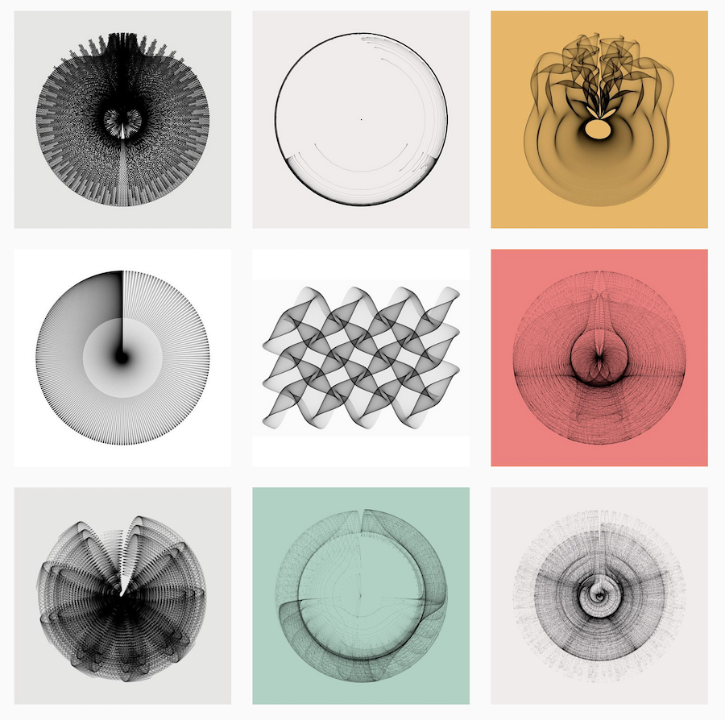
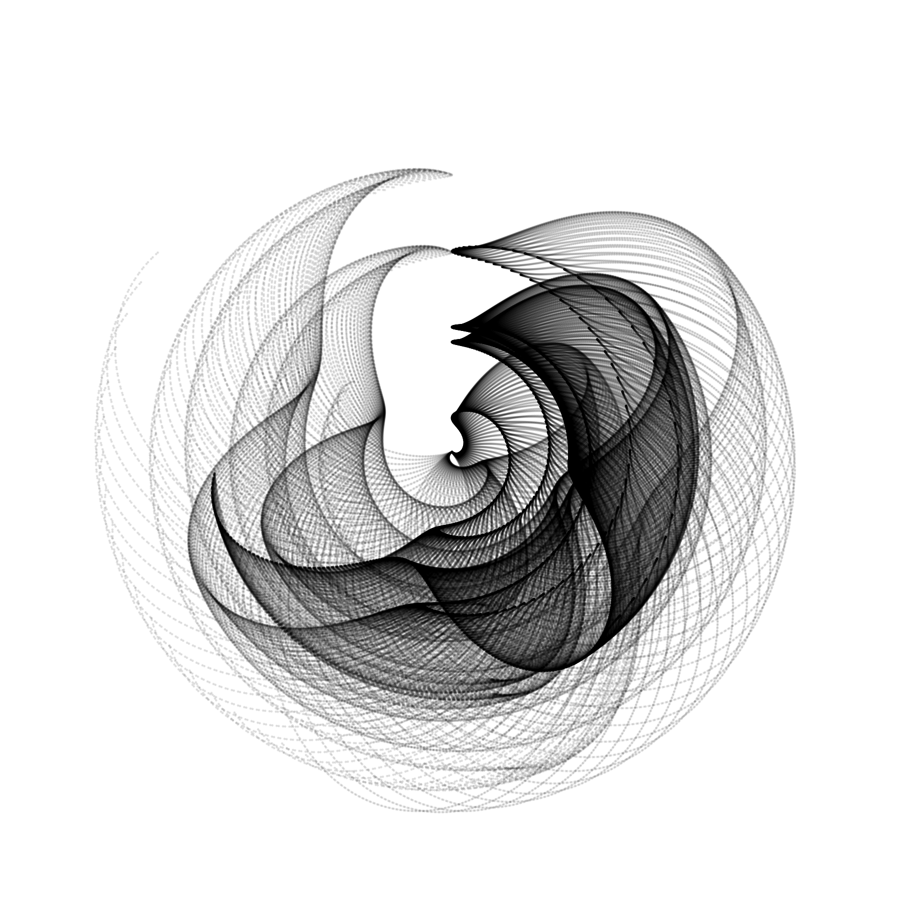
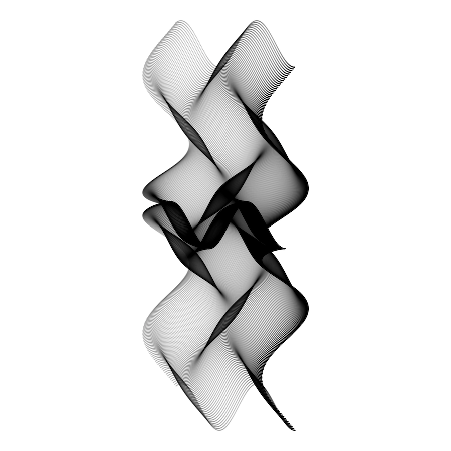

# generativeart

Create Generative Art with R.



[More on Instagram](https://www.instagram.com/cutterkom/)

## Description

> One overly simple but useful definition is that generative art is art programmed using a computer that intentionally introduces randomness as part of its creation process.
-- [Why Love Generative Art? - Artnome](https://www.artnome.com/news/2018/8/8/why-love-generative-art)

The `R` package `generativeart` let's you create images based on many thousand points. The position of every single point is calculated by a formula, which has random parameters. Because of the random numbers, every image looks different.

In order to make an image reproducible, `generative art` implements a log file that saves the `file_name`, the `seed` and the `formula`.

## Install

You can install the package with the `devtools` package directly from Github:

```
devtools::install_github("cutterkom/generativeart")
```

`generativeart` uses the `tidyverse` package.

## Usage

The package works with a specific directory structure that fits my needs best. The first step is to create it with `setup_directories()`. All images are saved by default in `img/everything/`. I use `img/handpicked/` to choose the best ones. In `logfile/` you will find a `csv` file that saves the `file_name`, the `seed` and the used `formula`.

```
library(generativeart)

# set the paths
IMG_DIR <- "img/"
IMG_SUBDIR <- "everything/"
IMG_SUBDIR2 <- "handpicked/"
IMG_PATH <- paste0(IMG_DIR, IMG_SUBDIR)

LOGFILE_DIR <- "logfile/"
LOGFILE <- "logfile.csv"
LOGFILE_PATH <- paste0(LOGFILE_DIR, LOGFILE)

# create the directory structure
generativeart::setup_directories(IMG_DIR, IMG_SUBDIR, IMG_SUBDIR2, LOGFILE_DIR)

# include a specific formula, for example:
my_formula <- list(
  x = quote(x_i^sample(1:4, 1) + sin(y_i^sample(1:4, 1))),
  y = quote(y_i^sample(1:4, 1) + sin(x_i^sample(1:4, 1)))
)

# call the main function to create five images with a polar coordinate system
generativeart::generate_img(formula = my_formula, nr_of_img = 5, polar = TRUE)

```

* You can create as many images as you want by setting `nr_of_img`.
* For every image a seed is drawn from a number between 1 and 10000.
* This seed determines the random numbers in the formula.
* You can choose between cartesian and polar coordinate systems by setting `polar = TRUE` or `polar = FALSE`
* the formula is a `list()`

## Examples

It is a good idea to use the sine and cosine in the formula, since it guarantees nice shapes, especially when combined with a polar coordinate system. One simple example:

```
my_formula <- list(
  x = quote(runif(1, -1, 1) * x_i^2 - sin(y_i^2)),
  y = quote(runif(1, -1, 1) * y_i^3 - cos(x_i^2))
)

generativeart::generate_img(formula = my_formula, nr_of_img = 5, polar = TRUE)

```

Two possible images:

`seed = 1821`, `polar = TRUE`:


`seed = 5451`, `polar = FALSE`:


The corresponding log file looks like that:

| file_name                      | seed | formula_x                            | formula_y                            | 
|--------------------------------|------|--------------------------------------|--------------------------------------| 
| 2018-11-16-17-13_seed_1821.png | 1821 | runif(1, -1, 1) * x_i^2 - sin(y_i^2) | runif(1, -1, 1) * y_i^3 - cos(x_i^2) | 
| 2018-11-16-17-12_seed_5451.png | 5451 | runif(1, -1, 1) * x_i^2 - sin(y_i^2) | runif(1, -1, 1) * y_i^3 - cos(x_i^2) | 


## Inspiration

The basic concept is heavily inspired by [Fronkonstin's great blog](https://fronkonstin.com/).
